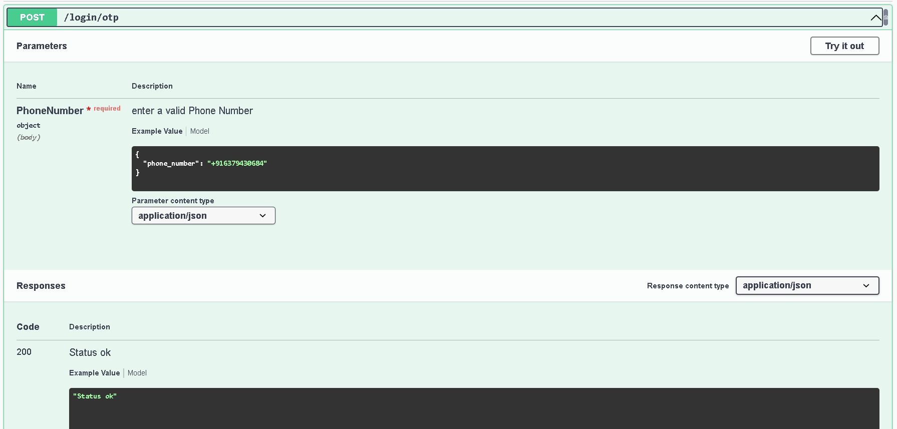
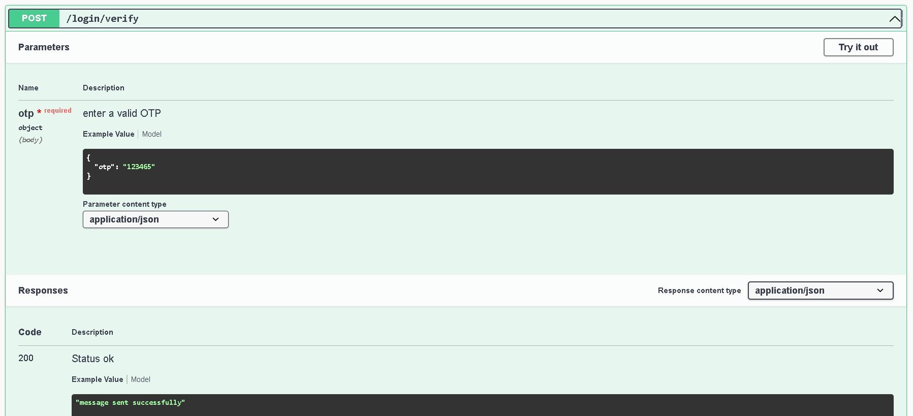
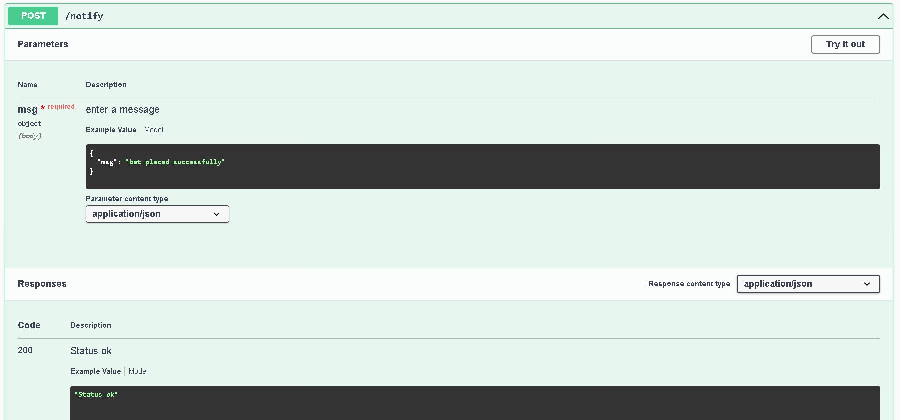

# SMS Notification Service

Welcome to the SMS Notification Service(SNS)! This README document provides an overview and instructions for implementing SMS notification and OTP (One-Time Password) authentication using SNS APIs.

## Table of Contents

- Introduction
- Prerequisites
- API Endpoints
- Examples
- Error Handling
- Acknowledgments

## Introduction

The service leverages the Twilio API, a powerful platform that allows you to send SMS messages programmatically. It enables you to utilize Twilio's functionality within your application.

**NOTE**: *Twilio Account Setup*: Before using this service, you need to create a Twilio account and obtain your Account SID and Auth Token. These credentials will be used to authenticate your API requests.

Here's an overview of how the service works:

1. **OTP Generation**: The service includes functionality to generate OTPs (One-Time Passwords). You can utilize this feature to implement OTP-based authentication in your application. The generated OTP is sent to users via SMS, providing them with a temporary, time-sensitive password for authentication.

2. **OTP Verification**: After sending the OTP to the user's phone, you can prompt them to enter the OTP in your application. The service allows you to compare the user-provided OTP with the stored OTP to verify its correctness. Based on the result, you can grant or deny access to your application.

3. **SMS Notification**: You can send SMS notifications to users by invoking the Twilio API with the recipient's phone number and the message you want to send. The service handles the communication between your application and Twilio, ensuring that the SMS is delivered successfully.

## Prerequisites

Before getting started, ensure that you have the following prerequisite in place:

- **Twilio Account**: Create a Twilio account at <https://www.twilio.com/> and obtain your Account SID and Auth Token. You will need these credentials to authenticate your API requests.

## API Endpoints

1.`/login/otp`

- Description: Send an authenication OTP to desired phone number.
- Request Types: POST

2.`/login/verify`

- Description: Enter 6 digit OTP recieved on phone number.
- Request Types: POST

3.`/notify`

- Description: Send a custom notification SMS.
- Request Types: POST

**NOTE**: the base path is `/api/v1`

## Examples

Here are a few examples to demonstrate how to use the SNS APIs:

1.Send an authenication OTP to desired phone number.

2.Enter the 6 digit OTP recieved on phone number.

3.Send a custom notification SMS.

## Error Handling

When an error occurs, the Customer-manager APIs return appropriate HTTP status codes along with error messages in the response body. Make sure to handle these errors gracefully in your application.

## Acknowledgments

This project utilizes the Twilio API and is inspired by the need for simple and reliable SMS notification and OTP authentication in Golang applications. We appreciate the contributions of the open-source community and the Twilio team for providing the necessary tools and resources.